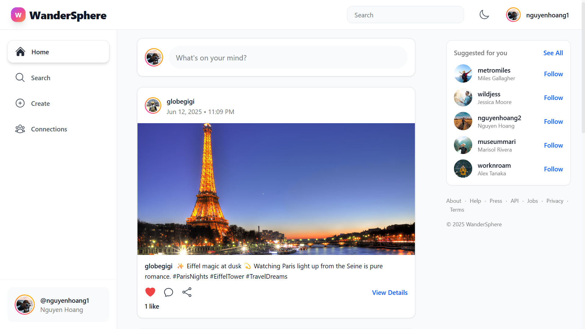

# WanderSphere 🌍

A modern social media platform built with Go microservices and React, featuring Instagram-style UI and real-time interactions.

## 📸 Demo

<div align="center">



</div>

## ✨ Features

- **Real-time newsfeed** with personalized content
- **Social networking** - follow users, like posts, comments
- **Image uploads** - multiple photos per post with S3 storage
- **Responsive design** - optimized for desktop and mobile
- **Microservices architecture** with event-driven updates

## 🚀 Quick Start

### Prerequisites
- Docker & Docker Compose
- 4GB+ RAM

### Setup
```bash
git clone <repository-url>
cd WanderSphere
docker-compose up -d
```

### Access
- **App**: http://localhost:5008
- **API**: http://localhost:19003
- **Storage Console**: http://localhost:9001

## 🏗️ Architecture

| Service | Description | Port |
|---------|-------------|------|
| Frontend | React app (Nginx) | 5008 |
| Backend | Go web API | 19003 |
| AuthPost | Authentication & Posts | 19001 |
| Newsfeed | Feed service | 19002 |
| PostgreSQL | Database | 5434 |
| Redis | Cache & sessions | 6379 |
| MinIO | File storage | 9000/9001 |
| Kafka* | Event streaming | 9092 |

*Optional for real-time features

## 🛠️ Development

```bash
# Start all services
docker-compose up -d

# View logs
docker-compose logs -f [service]

# Rebuild
docker-compose up -d --build

# Stop
docker-compose down
```

## 🔧 Tech Stack

**Backend**: Go, Gin, GORM, Redis, PostgreSQL, Kafka  
**Frontend**: React, TypeScript, Tailwind CSS, Axios  
**Storage**: MinIO (S3-compatible)  
**Deployment**: Docker Compose

---

Built with ❤️ by the WanderSphere team 