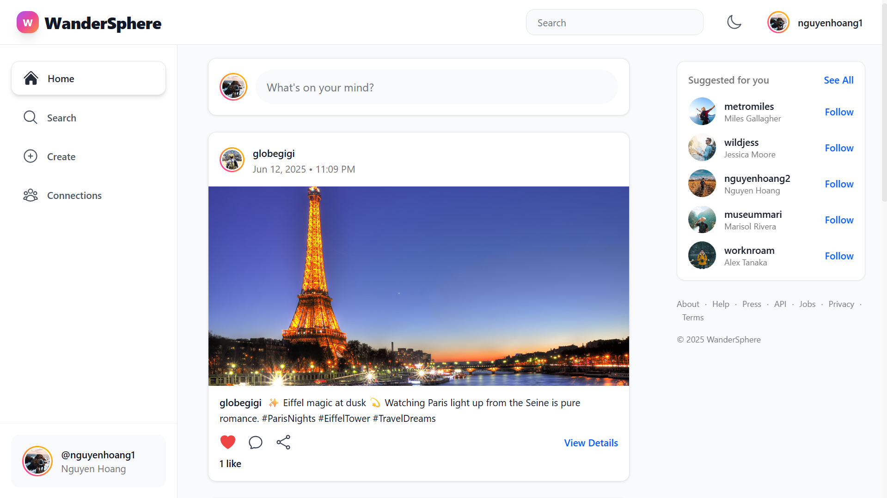
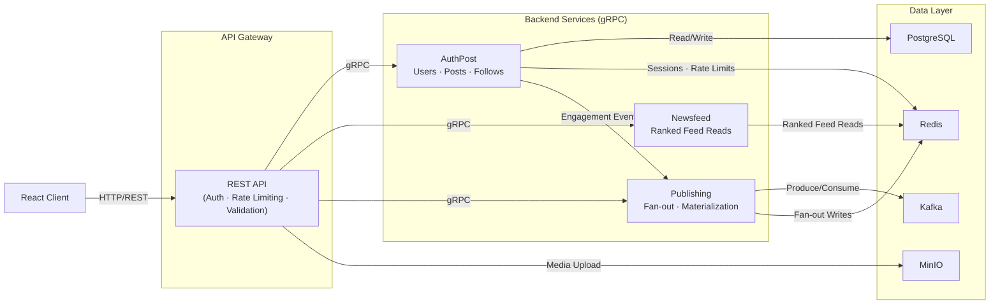

# 🌍 WanderSphere

**A distributed social media platform built with Go microservices, gRPC, Kafka, and Redis — designed to explore production-grade backend engineering from scratch.**


---

## Project Overview

WanderSphere is a social media platform where users create posts, follow others, and consume a personalized, ranked newsfeed. I designed and built this project independently to practice the kind of backend engineering that matters in production: service decomposition, event-driven processing, caching strategies, fault isolation, and observable infrastructure.

This isn't a weekend tutorial — I iterated on the architecture over time, introducing clear service boundaries, resilience patterns, and infrastructure components that reflect real-world trade-offs between consistency, availability, and operational complexity.



## Tech Stack

| Layer | Technology | Why |
|-------|-----------|-----|
| Frontend | React, TypeScript, Tailwind CSS | Type-safe component model with utility-first styling for rapid UI iteration |
| API Gateway | Go, Gin | Lightweight HTTP framework with middleware chaining for auth, rate limiting, and validation |
| Service Communication | gRPC, Protocol Buffers | Type-safe contracts enforced at compile time with lower serialization overhead than JSON/REST |
| Backend Services | Go, GORM | Strongly typed ORM for relational data access with migration support |
| Database | PostgreSQL | ACID-compliant relational store for users, posts, comments, likes, and follow graphs |
| Cache & Feed Store | Redis | Sorted sets for ranked feeds, lists for fallback storage, and key-based session/rate-limit data |
| Event Streaming | Kafka, Zookeeper | Durable, ordered event log for decoupling write operations from async feed materialization |
| Object Storage | MinIO | S3-compatible API for local media storage without cloud dependency |
| Observability | Prometheus, Grafana | Pull-based metrics collection with dashboarding for request rates, latencies, and service health |
| Orchestration | Docker, Docker Compose | Reproducible multi-service environment with health checks and dependency ordering |

## Architecture

WanderSphere is decomposed into four backend services, each owning a distinct responsibility and communicating through well-defined gRPC contracts. This separation allows each service to evolve, scale, and fail independently.


```mermaid
graph LR
    Client["React Client"]

    subgraph Gateway["API Gateway"]
        GW["REST API\n(Auth · Rate Limiting · Validation)"]
    end

    subgraph Services["Backend Services (gRPC)"]
        AP["AuthPost\nUsers · Posts · Follows"]
        NF["Newsfeed\nRanked Feed Reads"]
        PUB["Publishing\nFan-out · Materialization"]
    end

    subgraph Data["Data Layer"]
        PG["PostgreSQL"]
        RD["Redis"]
        KF["Kafka"]
        S3["MinIO"]
    end

    Client -->|"HTTP/REST"| GW
    GW -->|"gRPC"| AP
    GW -->|"gRPC"| NF
    GW -->|"gRPC"| PUB
    GW -->|"Media Upload"| S3

    AP -->|"Read/Write"| PG
    AP -->|"Sessions · Rate Limits"| RD
    AP -->|"Engagement Events"| PUB

    PUB -->|"Produce/Consume"| KF
    PUB -->|"Fan-out Writes"| RD

    NF -->|"Ranked Feed Reads"| RD
```

### Request Flow

**Write path** — When a user creates a post, the API Gateway forwards the request via gRPC to the AuthPost service, which persists it in PostgreSQL. AuthPost then emits an engagement event to the Publishing service, which produces a Kafka message. The Publishing service consumes these events and fans out feed updates to Redis sorted sets for each follower, materializing the feed at write time.

**Read path** — When a user opens their feed, the Gateway calls the Newsfeed service via gRPC. The Newsfeed service reads from Redis sorted sets (ranked by engagement score) and returns results using cursor-based pagination. If ranked data is unavailable, it falls back to a Redis list-based feed to preserve availability.

## Key Features

- **Event-driven feed pipeline** — Kafka-backed fan-out decouples post creation from feed materialization, shifting write complexity to async processing so reads remain fast and simple.
- **Ranked feed with fallback** — Redis sorted sets power engagement-weighted feed ranking. When ranked data is unavailable, a list-based fallback preserves availability rather than returning empty results.
- **Cursor-based pagination** — Encoded cursors provide stable iteration over mutable timelines, avoiding the duplicate and skipped-item issues common in offset-based pagination under concurrent writes.
- **Resilience patterns** — Per-host gRPC circuit breakers with exponential backoff prevent cascading failures. Kafka consumers use Redis `SetNX` for idempotent processing, and failed events route to dead-letter topics for retry.
- **API security and rate limiting** — Redis-backed rate limiting with response headers for limit, remaining capacity, and reset time. Security headers, request size controls, and login lockout protect public endpoints.
- **Multi-layer testing** — Unit tests for service logic, API integration tests for cross-service behavior, Go micro-benchmarks for hot-path validation, and k6 load-test scripts for throughput profiling.
- **Observability** — Health endpoints across all services, Prometheus metrics for HTTP/gRPC requests, rate limiting, circuit-breaker state, and Kafka consumer processing, with Grafana dashboards for visualization.
- **Auto-generated API documentation** — Swagger docs generated from handler annotations, available at runtime for API exploration and contract validation.

## What I Learned / Engineering Decisions

**Fan-out on write vs. fan-out on read** — I chose write-time fan-out via Kafka → Redis because it shifts complexity to the write path where asynchronous processing absorbs latency, keeping the read path simple and predictably fast. The trade-off is higher write-side complexity and storage cost per follower, but for a social feed where reads vastly outnumber writes, this is the right balance.

**Cursor-based vs. offset-based pagination** — Offset pagination breaks under concurrent inserts: users see duplicates or skip items as the underlying data shifts. Cursor-based pagination with encoded timestamps provides stable iteration regardless of concurrent writes, which matters for any feed that updates in real time.

**Per-host circuit breakers vs. global circuit breakers** — A global circuit breaker trips all traffic when any single downstream instance is unhealthy. Per-host granularity isolates failures to the affected instance, allowing healthy replicas to continue serving. This required more state management but significantly improved fault isolation.

**Redis sorted sets for feed ranking vs. application-layer sorting** — Delegating ranking to Redis `ZRANGEBYSCORE` with engagement-weighted scores avoids re-sorting on every read and leverages Redis's O(log N) insertion. The alternative — sorting in application memory — doesn't scale with feed size and adds latency to every read request.

**gRPC over REST for inter-service communication** — Protobuf contracts enforce type safety at compile time and fail fast on schema mismatches, which catches integration issues before deployment. The binary serialization also reduces payload size compared to JSON, though the primary motivation was contract enforcement, not raw throughput.

## Getting Started

### Prerequisites

- Docker Desktop with Docker Compose
- Git

### Run locally

```bash
git clone https://github.com/hoangNguyenDev3/WanderSphere.git
cd WanderSphere
docker-compose up -d --build
```

This starts the full stack: 4 backend services, PostgreSQL, Redis, Kafka, MinIO, Prometheus, and Grafana. Initial startup may take 1–2 minutes as services wait for health checks on their dependencies.

### Verify services

```bash
docker-compose ps
curl http://localhost:19003/health
```

### Endpoints

| Service | URL |
|---------|-----|
| Web App | `http://localhost:5008` |
| API Base | `http://localhost:19003/api/v1` |
| Swagger Docs | `http://localhost:19003/swagger/index.html` |
| Prometheus | `http://localhost:9090` |
| Grafana | `http://localhost:3001` |
| MinIO Console | `http://localhost:9001` |

### Backend development

```bash
cd backend
make start        # Start full backend stack
make test         # Run unit tests
make test-api     # Run API/integration tests
make proto        # Regenerate gRPC code
make docs         # Regenerate Swagger docs
```

For detailed backend architecture, service operations, and the full command reference, see [`backend/README.md`](backend/README.md).
